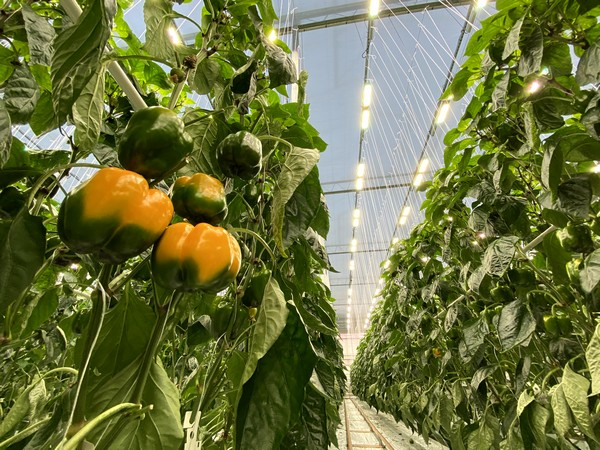

**Dec 27th 2021** 
**MPAD2003A Introductory Data Storytelling** 
**Joelle Lui** 
**Presented to Jean-Sébastien Marier** 
___
# Ontario Peppers: Higher Yield but Higher Prices?
### By: Joelle Lui
 
Ontario grows a wide variety of peppers, from sweet to hot, banana to cherry, and others. The most widely grown pepper in Ontario, however, are bell peppers, which are grown in fields or in greenhouses, where farmers use hydroponic systems to grow them. Ontario exports peppers both domestically in Canada and to other countries, such as the United States. Every year, there is a higher demand for locally grown peppers because of the rise in popularity, and in response to the high demand, farmers begin to improve the way they farm to increase the yield. As farmers try to match the demand for peppers, the price of the product is still going up. If Ontario is increasing their pepper yield drastically, why are the prices going up? 
 
 
 

  
   
  <i>An Allegro Acres facilitiy using Sollum Technologies smart lighing technology in a greenhouse
  <a href="https://www.hortidaily.com/article/9313875/now-we-can-adjust-our-greenhouse-lighting-in-real-time/">https://www.hortidaily.com/article/9313875/now-we-can-adjust-our-greenhouse-lighting-in-real-time/</a>
  </i>

  
As demand is growing for peppers, farmers need to accommodate for this by increasing the yield. To match consumer demand, Mucci Farms, a produce wholesaler that has farms located in Ontario and Ohio, started expanding their acreage for their produce. During the 60s and 70s, the greenhouse industry started to evolve in Ontario as there was a lot of knowledge surrounding tomatoes, which made the greenhouse transition easy. Pepper cultivation in the greenhouse soon followed. According to Bert Mucci, the CEO of Mucci Farms, “By virtue of that timeline, there was always less pepper production, but it has ramped up in recent years as growing expertise and popularity has gone up”
 
 

Greenhouse farming has many benefits for growing produce, which include better control over the environment and growing conditions, a longer growing season because farms can grow produce during the winter, and it can boost organic produce because of reduced use of pesticides. Another benefit would be that they are also able to grow a wide variety of peppers in one greenhouse. Greenhouse farming of peppers allow them to be better in taste, size, appearance, and have an increase of yield. As greenhouses benefit the overall quality of produce, it is also more sustainable because the goal is to maximize energy efficiency while still producing a large amount of crop. One Ontario-based pepper greenhouse, Allegro Acres, has teamed up with Sollum Technologies to create an LED light recipe best suited for pepper production to optimize plant growth for the first time. 
 
 
 

<iframe title="Average Yield (tonnes/ha) of Ontario Peppers" aria-label="Interactive line chart" id="datawrapper-chart-3m4A3" src="https://datawrapper.dwcdn.net/3m4A3/3/" scrolling="no" frameborder="0" style="width: 0; min-width: 100% !important; border: none;" height="439"></iframe>

 

Even though there are better, sustainable, farming techniques, that has contributed to more yield, prices for produce are at an all time high, especially peppers. Some reasons for this price increase include the weather conditions affecting field peppers. As Ontario is province that has rainfall and is cloudy, the volumes produced are slightly lower. This results in some scarcity in the market, so prices have risen slightly. When it comes to small scale growers, Mucci Farms says it is “more efficient and profitable to grow tomatoes or cucumbers as there is always high demand for specific staple items”, which can be grown and sold exclusively. In the case of bell peppers, they “require scale to satisfy retailer and consumer demand for multiple colours and varieties”.
 
 
 

<iframe title="Average Price ($/tonne) of Ontario Peppers " aria-label="Interactive line chart" id="datawrapper-chart-3FemX" src="https://datawrapper.dwcdn.net/3FemX/2/" scrolling="no" frameborder="0" style="width: 0; min-width: 100% !important; border: none;" height="400"></iframe>

 
Ontario’s production of peppers has grown significantly since the 1980s, due to the rising popularity and demand for such product. As years progress, farming techniques improve to allow for a sustainable and efficient way to produce fruits and vegetables, especially during the colder months of the year. Although it is more efficient and profitable to grow tomatoes and cucumbers, there is still a high demand for peppers. Farmers must produce them more than ever as innovative farming is critical for feeding the country and economic growth of our industry. 
 
 
 

[Link to dataset used for the visualizations](http://omaf.gov.on.ca/english/stats/hort/pepper.htm).
 
 
 

 >***
 >METHODOLOGY 
 >The sources I used for thie article came from official government sites, online forums/online agriculture communities, and the official sites of Ontario producers 
 >___

 
 
<b><u> Sources</b></u>
 

<ol>
<li><a href="http://omaf.gov.on.ca/english/stats/hort/pepper.htm">http://omaf.gov.on.ca/english/stats/hort/pepper.htm </a></li>
 
<li><a href="http://www.omafra.gov.on.ca/IPM/english/peppers/index.html">http://www.omafra.gov.on.ca/IPM/english/peppers/index.html</a></li>
 
<li><a href="https://www.hortidaily.com/article/9374750/domestically-grown-produce-has-become-a-necessity/
">https://www.hortidaily.com/article/9374750/domestically-grown-produce-has-become-a-necessity/
l</a></li>
 
<li><a href="http://www.omafra.gov.on.ca/IPM/english/peppers/index.html">http://www.omafra.gov.on.ca/IPM/english/peppers/index.html</a></li>
 
<li><a href="https://www.hortidaily.com/article/9342659/growing-pepper-cultivars-with-shorter-internode-characteristics-with-adjustable-spectrum/
">https://www.hortidaily.com/article/9342659/growing-pepper-cultivars-with-shorter-internode-characteristics-with-adjustable-spectrum/
</a></li>
 
<li><a href="https://www.hortidaily.com/article/6036264/overview-global-pepper-market/
">https://www.hortidaily.com/article/6036264/overview-global-pepper-market/
</a></li>
</ol>

